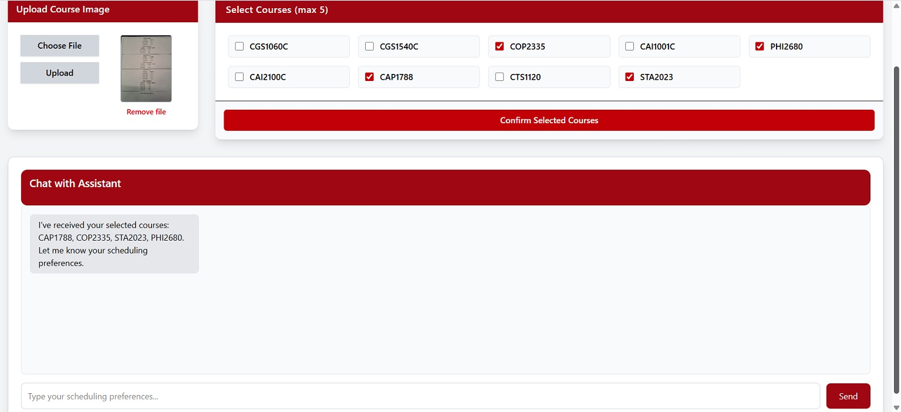
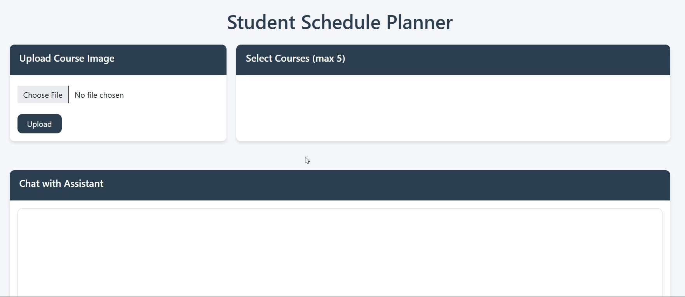
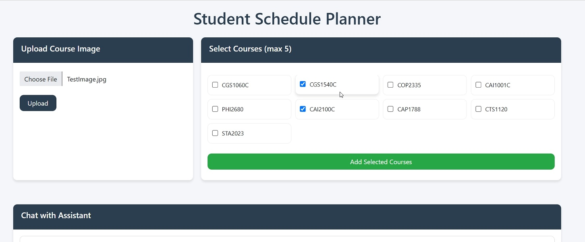
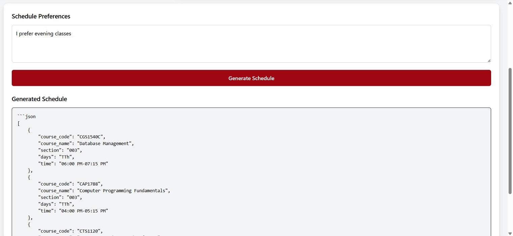
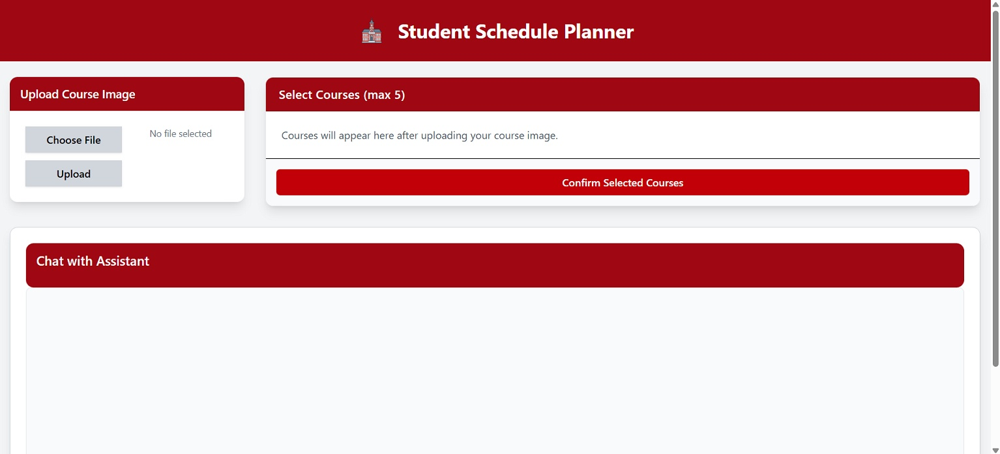

# 🏫 Student Schedule Planner



An AI-powered schedule-building system combining computer vision and an LLM-based assistant into a clean, modern interface that transforms an image of your course list into a personalized class schedule.

This MVP demonstrates **full-stack engineering**, **OCR text extraction**, **LLM-driven parsing**, **CSV-based schedule matching**, and a **conversational planning assistant** — all presented through a custom-built React interface.

### 🔴 Live FRONTEND ONLY Demo  
Coming Soon  
(Backend functionality requires running locally.)

---


## ✨ Features

### 📷 Image Upload + OCR  
- Upload JPG/PNG course list images  
- FastAPI backend receives file bytes  
- Tesseract OCR processes the image  
- Modular OCR implementation (`ocr.py`)

### 🤖 LLM Course Extraction  
- gpt-4o-mini parses OCR text  
- Returns valid course codes  
- Removes duplicates  

### 🧩 Course Selection  
- Choose up to 5 classes  
- Responsive Tailwind UI  
- “Processing…” state  
- Auto-confirmation message sent to chat  

### 💬 AI Chat Assistant  
- React chat window  
- Assistant typing animation  
- CSV-based section matching  


---

## 🏗️ System Architecture

```
Frontend (React) -> FastAPI Backend -> OCR + LLM + CSV Matching
```

---

## 🛠️ Tech Stack

### Frontend
- React  
- Vite  
- TailwindCSS  

### Backend
- Python  
- FastAPI  
- Tesseract OCR  
- OpenAI gpt-4o-mini  

---


## 🚀 Running the System Locally

**Python Version:** 3.10.x

### Backend

```bash
cd backend
python -m venv .venv
.venv\Scripts\activate
pip install -r requirements.txt
uvicorn main:app --reload
```

### Frontend

```bash
cd frontend
npm install
npm run dev
```

---

# 🛤️ Development Journey

### Story 1 — Early Prototype  


### Story 2 — OCR + Extraction Working  


### Story 3 — First LLM Schedule Output  


### Story 4 — Pre-Final UI  


---

## 📅 Future Roadmap  
- Calendar view  
- Compare schedule options  
- PDF export  
- Save schedules locally  
- Deploy backend  

---

## 📄 License  
MIT License

---

## 👤 Author

**Christopher Mena**
AI/ML Engineer
GitHub: https://github.com/ChrisDevAI
Website: https://ChrisAI.dev
LinkedIn: https://linkedin.com/in/ChrisDevAI

