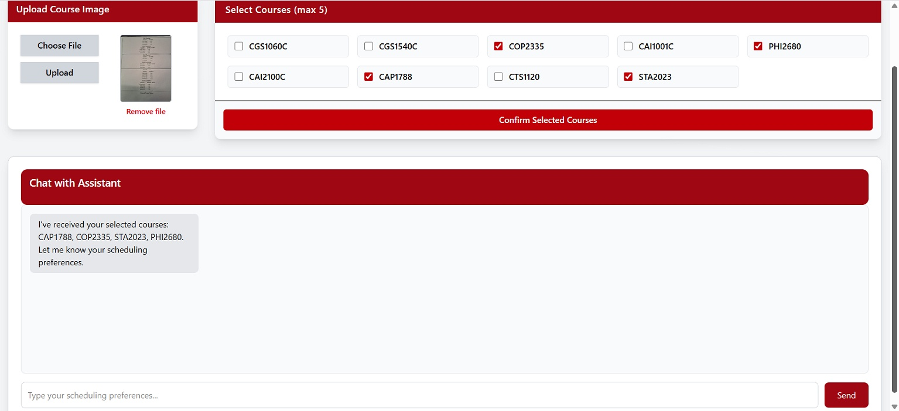
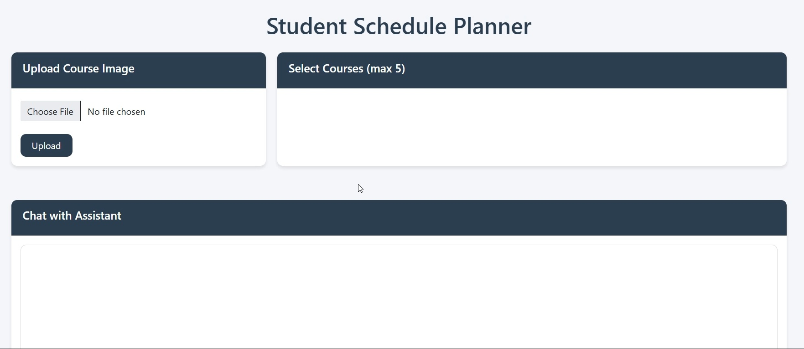
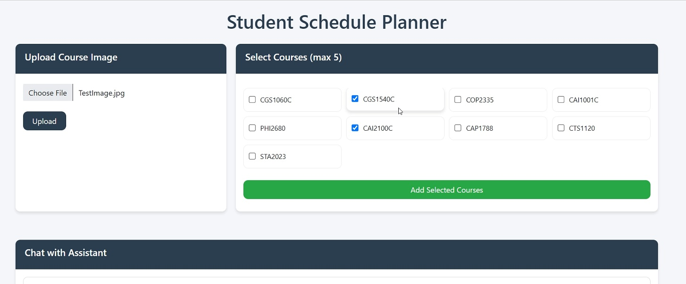
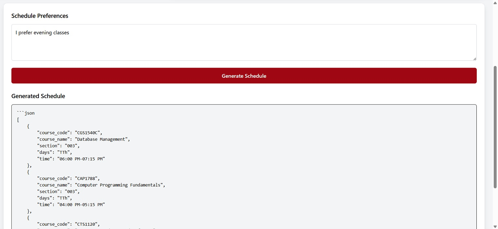
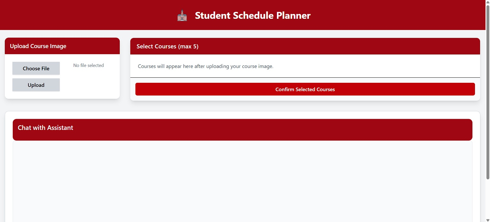

# Student Schedule Planner



Student Schedule Planner is an AI-assisted scheduling application that converts a course-list image into a conflict-free class schedule through a structured pipeline built around OCR, deterministic extraction, and rule-based schedule generation.

The system uses computer vision and OCR to read course information from an uploaded image, validates course codes through deterministic matching, generates a schedule from a synthetic course catalog, and uses an LLM only to explain the final result in plain English.

---

## Live Demo

**Frontend-only demo:**  
https://student-schedule-planner-75ce2.web.app/

> Backend functionality requires running locally.

---

## Why This Project

Building a class schedule from a course list can be slow, repetitive, and error-prone. Students often have to manually read a course guide, identify valid classes, compare sections, and avoid time conflicts by hand.

This project was designed to turn that workflow into a structured software pipeline:

- OCR extracts raw text from an uploaded image
- Deterministic pattern matching identifies valid course codes
- The user selects the courses they want
- A rule-based scheduling engine builds a conflict-free schedule
- An LLM explains the final schedule without controlling the scheduling logic

This architecture keeps the system reliable and auditable by reserving the LLM for explanation only, while extraction, validation, and schedule generation remain deterministic.

---

## Features

### OCR and Image Processing
- Upload JPG and PNG course-list images
- Extract raw text through a modular OCR pipeline
- Process file uploads through a FastAPI backend
- Use Tesseract OCR for document-to-text conversion

### Deterministic Course Extraction
- Extract course codes using regex-based pattern matching
- Filter extracted values against the synthetic course catalog
- Normalize and deduplicate valid course codes
- Avoid LLM dependence for course-code extraction

### Course Selection Workflow
- Let users select the courses they want to take
- Support responsive interaction through a React and Tailwind UI
- Provide loading and confirmation states
- Keep the frontend component-based and modular

### Schedule Generation
- Use a synthetic CSV dataset of course sections
- Select one valid section per chosen course
- Detect and avoid time conflicts
- Return the first valid conflict-free schedule

### Explanation Layer
- Generate a plain-English explanation of the final schedule
- Keep the LLM separate from extraction and scheduling
- Fall back gracefully if the explanation service is unavailable
- Return the completed schedule even when the LLM is unavailable

---

## Tech Stack

### Frontend
- React
- Vite
- Tailwind CSS

### Backend
- Python
- FastAPI
- Tesseract OCR
- OpenAI API
- Deterministic scheduling engine
- CSV-based synthetic course database

---

## Architecture Overview

The application follows a structured pipeline:

1. A student uploads an image of a course list
2. OCR extracts raw text from the image
3. Deterministic pattern matching identifies valid course codes
4. The student selects which courses to include
5. A deterministic scheduling engine builds a conflict-free schedule from a synthetic CSV course database
6. An LLM optionally explains the final schedule in plain English
7. If the LLM is unavailable, the system still returns the completed schedule through a fallback path

This design reflects an important engineering decision: use deterministic logic where correctness, control, and auditability matter most, and use the LLM only where natural-language flexibility adds value.

---

## Iteration and Development Journey

This project evolved from an early AI-assisted prototype into a more disciplined system with clearer architectural boundaries.

### Early Prototype
The initial version helped validate the user workflow: turning a course-list image into a usable schedule through an AI-assisted pipeline.



### OCR and Extraction Progress
The next phase focused on getting OCR and extraction working reliably enough to identify course information from uploaded images.



### Early Scheduling and LLM Output
An earlier version used the LLM more directly in the scheduling process. That helped prototype the user experience, but it also exposed the need for stronger control over correctness and repeatability.



### Refined Final Direction
The final architecture moved extraction, validation, and schedule generation into deterministic logic, while reserving the LLM for plain-English explanation only. This improved reliability, debugging clarity, and overall engineering quality.



The result is a stronger full-stack AI application with better system boundaries, more defensible design choices, and a clearer production-minded workflow.

---

## Installation

**Python version:** 3.10.x

### Clone the repository

```bash
git clone https://github.com/ChrisDevAI/student-schedule-planner.git
cd student-schedule-planner
```

---

## Backend Setup

```bash
cd backend
py 3.10 -m venv .venv
.venv\Scripts\activate
python -m pip install -r requirements.txt
uvicorn main:app --reload
```

---

## Frontend Setup

```bash
cd frontend
npm install
npm run dev
```

A sample test image is located at:

```text
frontend/public/test-image.jpg
```

---

## Project Status

This project is a functional MVP that demonstrates a structured AI-assisted workflow built on deterministic business logic. Its core strength is the architectural decision to keep extraction, validation, and schedule generation rule-based, while using the LLM only for explanation.

The project can be expanded further, but the current version already demonstrates practical AI integration, full-stack delivery, and sound engineering judgment.

---

## Why This Project Matters

This project was designed to solve a real student workflow problem, not just serve as a technical demo.

It also demonstrates practical engineering judgment. Instead of relying on an LLM for tasks that require correctness and control, the system uses deterministic logic for extraction, validation, and schedule construction, while reserving the LLM only for plain-English explanation. That makes the application more reliable, easier to debug, and better aligned with real-world software design.

The idea also has broader institutional potential and could be expanded into a more capable academic scheduling tool in the future.

---

## License

MIT License

---

## Author

**Christopher Mena**  
Applied AI / ML Engineering Student  

- GitHub: https://github.com/ChrisDevAI  
- Website: https://chrisai.dev  
- LinkedIn: https://linkedin.com/in/ChrisDevAI


